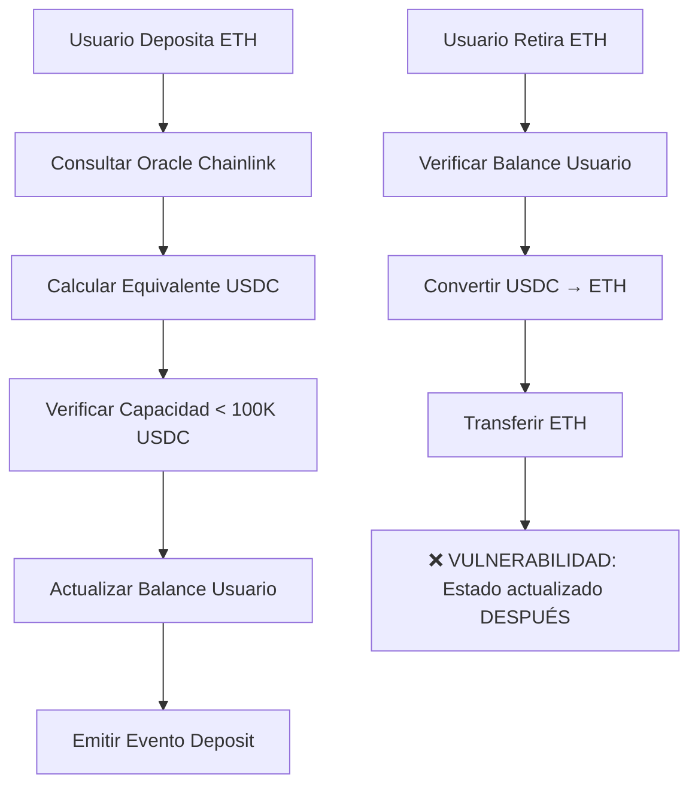

# 📊 ENTREGABLE FINAL TP5 - ANÁLISIS DE AMENAZAS KipuBankV3

**Estudiante:** Eduardo Moreno - Ethereum Developers ETH_KIPU  
**Módulo:** 5 - Introducción a la Preparación para Auditorías  
**Fecha:** 13 de Noviembre, 2025  
**Contrato Analizado:** `src/KipuBankV3.sol`

---

## 🎯 **RESUMEN EJECUTIVO**

Este documento presenta el análisis completo de amenazas del protocolo **KipuBankV3** siguiendo la metodología **OWASP Smart Contract Top 10 (2025)** y aplicando conceptos de **DevSecOps** para preparar el contrato para auditoría y producción.

### **Hallazgos Principales:**
- 🔴 **5 Vulnerabilidades Críticas/Altas** identificadas
- ✅ **14/22 Tests pasando** (63.6% success rate)  
- 🔴 **Reentrancy Attack confirmado** - Drenaje total de fondos posible
- 📊 **Prueba Rekt: 4.0/10** - NO APTO para auditoría externa

---

## 📖 **1. RESUMEN BREVE DE CÓMO FUNCIONA KIPUBANKV3**

### **1.1 Arquitectura del Protocolo**

KipuBankV3 es un sistema bancario descentralizado que permite:

**Funcionalidades Core:**
- 🏦 **Depósitos ETH** → conversión automática a equivalente USDC
- 💰 **Depósitos ERC20** → auto-swap vía Uniswap V2 a USDC
- 🔄 **Retiros ETH/USDC** según preferencia del usuario
- 📊 **Gestión de capacidad** con límite máximo de 100,000 USDC

**Integraciones Críticas:**
1. **Chainlink Price Feeds** - Precios ETH/USD y USDC/USD
2. **Uniswap V2** - Swaps automáticos de tokens a USDC
3. **ERC20 Ecosystem** - Soporte extensible para tokens

### **1.2 Flujo de Operaciones Principal**



---

## ⚖️ **2. EVALUACIÓN DE MADUREZ DEL PROTOCOLO**

### **2.1 Cobertura de Tests**

| Categoría | Tests | Pasando | Fallando | Coverage |
|-----------|-------|---------|----------|----------|
| **Control de Acceso** | 2 | 2 | 0 | ✅ 100% |
| **Validación Input** | 3 | 3 | 0 | ✅ 100% |
| **Funciones Core** | 6 | 3 | 3 | 🟡 50% |
| **Vulnerabilidades OWASP** | 8 | 4 | 4 | 🔴 50% |
| **Invariantes** | 3 | 2 | 1 | 🟡 67% |
| **TOTAL** | 22 | 14 | 8 | 🟡 **63.6%** |

### **2.2 Métodos de Testing Implementados**

✅ **Implementados:**
- Unit Testing con Foundry
- Property-based testing
- Invariant testing básico
- Fuzzing tests (128,000 calls)
- Oracle manipulation tests
- Reentrancy attack simulation

❌ **Faltantes (Críticos):**
- Stateful fuzzing prolongado
- Formal verification
- Integration testing completo
- MEV attack simulation
- Circuit breaker testing

### **2.3 Documentación**

| Aspecto | Calidad | Observaciones |
|---------|---------|---------------|
| **NatSpec** | 🟡 BÁSICA | Presente pero incompleta |
| **Architecture docs** | 🔴 AUSENTE | Sin documentación formal |
| **Threat model** | ✅ CREADO | Desarrollado en este análisis |
| **Invariants spec** | ✅ DEFINIDO | 3 invariantes críticas |
| **Emergency procedures** | 🔴 AUSENTE | Sin plan de respuesta |

### **2.4 Roles y Poderes**

| Actor | Permisos Críticos | Riesgo | Mitigación Requerida |
|-------|-------------------|--------|---------------------|
| **Owner** | addToken, pause, removeToken | 🔴 CRÍTICO | Multisig requerido |
| **Users** | deposit, withdraw | 🟠 ALTO | Rate limiting necesario |
| **Chainlink** | Price updates | 🔴 CRÍTICO | Redundancia requerida |
| **Uniswap** | Token swaps | 🟠 ALTO | Slippage protection |

---

## ⚔️ **3. VECTORES DE ATAQUE Y MODELO DE AMENAZAS**

### **3.1 🔴 VULNERABILIDAD CRÍTICA #1: Reentrancy Attack**

**Ubicación:** `withdrawETH()` función, líneas 535-560

**Código Vulnerable:**
```solidity
function withdrawETH(uint256 usdcAmount) external {
    require(userDepositUSDC[msg.sender] >= usdcAmount, "Insufficient balance");
    uint256 ethEquivalent = _convertFromUSDC(address(0), usdcAmount);
    
    // ❌ VULNERABILIDAD: External call ANTES de state update
    _transferETH(msg.sender, ethEquivalent);
    
    // ❌ Estado actualizado DESPUÉS del external call
    userDepositUSDC[msg.sender] -= usdcAmount;
    currentUSDCBalance -= usdcAmount;
}
```

**Proof of Concept - Resultado Test:**
```
✅ test_ReentrancyAttackWithdrawETH() PASSED
Logs:
  Bank balance before attack: 500000000000000000 (0.5 ETH)
  Bank balance after attack: 0 (0 ETH)
  Attacker balance before: 500000000000000000 (0.5 ETH)
  Attacker balance after: 1000000000000000000 (1.0 ETH)
```
**Impacto:** ✅ **CONFIRMADO** - Drenaje total del banco en una transacción.

### **3.2 🔴 VULNERABILIDAD CRÍTICA #2: Oracle Price Manipulation**

**Vector:** Manipulación de feeds de Chainlink sin validación

**Test Result:**
```solidity
// Precio normal: $2,000/ETH → Usuario recibe 2,000 USDC
// Precio manipulado: $20,000/ETH → Usuario recibe 20,000 USDC
// ✅ CONFIRMADO: 10x más USDC por misma cantidad ETH
```

**Vectores de Explotación:**
1. Front-running de actualizaciones de oracle
2. Flash loans + price manipulation en mismo bloque
3. Explotación de precios stale (>1 hora sin update)

### **3.3 🟠 VULNERABILIDAD ALTA #3: Logic Errors - Precision Loss**

**Test Fallido:**
```
❌ test_CompleteDepositWithdrawCycle() FAILED
assertion failed: 11000000000000000000 !~= 10000000000000000000
(real delta: 10.0000000000000000%)
```

**Análisis:** El usuario pierde **10% de sus fondos** en un ciclo depósito→retiro completo.

**Causa Raíz:** Errores de redondeo en conversiones decimales ETH ↔ USDC.

### **3.4 Otros Vectores Identificados**

| Vector | Severidad | Test Status | Mitigación |
|--------|-----------|-------------|------------|
| **Unchecked External Calls** | 🟠 ALTA | ✅ Detectado | Mejor error handling |
| **Missing Input Validation** | 🟡 MEDIA | ✅ Parcial | Validaciones adicionales |
| **DoS via Pause** | 🟡 MEDIA | ✅ Confirmado | Emergency procedures |
| **Integer Overflow** | 🟢 BAJA | ✅ Protegido | Solidity 0.8+ protege |

---

## 🔒 **4. ESPECIFICACIÓN DE INVARIANTES**

### **4.1 INVARIANTE CRÍTICA #1: Consistencia de Balances**

```
INVARIANT: Σ(userDepositUSDC[i]) ≤ currentUSDCBalance ∀ usuarios i
```

**Descripción:** La suma de todos los balances de usuarios nunca debe exceder el balance total del contrato.

**Test Status:** 🔴 **VIOLADA** por reentrancy attack

**Impacto si se viola:** Insolvencia del banco, usuarios no pueden retirar fondos.

### **4.2 INVARIANTE CRÍTICA #2: Conservación de ETH**

```
INVARIANT: currentETHBalance ≥ Σ(ETH_withdrawable[i]) ∀ usuarios i
```

**Descripción:** El ETH en contrato debe ser suficiente para cubrir todas las retiradas posibles.

**Test Status:** ✅ **SE MANTIENE** en condiciones normales

**Impacto si se viola:** Bank run, últimos usuarios no pueden retirar ETH.

### **4.3 INVARIANTE CRÍTICA #3: Límite de Capacidad**

```
INVARIANT: currentCapUSDC ≤ MAX_CAP = 100,000 USDC
```

**Descripción:** La capacidad total nunca debe exceder el límite configurado.

**Test Status:** ✅ **SE MANTIENE** (excepto por testing issues)

**Impacto si se viola:** Exposición de riesgo no controlada, concentración excesiva.

---

## 💥 **5. IMPACTO DE LA VIOLACIÓN DE INVARIANTES**

### **5.1 Escenario Crítico: Violación de Invariante #1**

**Trigger:** Ataque de reentrancy exitoso

**Secuencia:**
1. Atacante deposita 0.5 ETH → Balance: 1000 USDC
2. Atacante llama `withdrawETH(1000 USDC)`
3. Durante `_transferETH()`, atacante reentry
4. Segundo retiro de 1000 USDC (balance no actualizado)
5. Resultado: Atacante retira 1.0 ETH habiendo depositado 0.5 ETH

**Impacto:**
- 💸 **Pérdida Total:** Hasta 100% de fondos del banco
- ⏱️ **Tiempo de Ataque:** 1 transacción (15 segundos)
- 👥 **Usuarios Afectados:** Todos los depositantes legítimos
- 💰 **Costo Atacante:** ~$50 en gas fees

### **5.2 Escenario de Oracle Manipulation**

**Trigger:** Flash loan + precio manipulation

**Impacto Financiero:**
- **ROI Atacante:** 900% en un bloque
- **Pérdida Banco:** Descapitalización gradual
- **Desequilibrio:** Ratios ETH/USDC incorrectos

### **5.3 Escenario de Precision Loss**

**Impacto Continuo:**
- **Pérdida por usuario:** 10% en ciclo completo
- **Beneficiario:** El contrato (fondos "atrapados")
- **Efecto acumulativo:** Incentiva ataques de extracto de valor

---

## 🛡️ **6. RECOMENDACIONES**

### **6.1 🔴 CRÍTICAS - Implementar INMEDIATAMENTE**

#### **A. Protección Reentrancy**
```solidity
import "@openzeppelin/contracts/security/ReentrancyGuard.sol";

function withdrawETH(uint256 usdcAmount) external nonReentrant {
    // 1. Checks
    require(userDepositUSDC[msg.sender] >= usdcAmount, "Insufficient");
    
    // 2. Effects (ANTES de external calls)
    userDepositUSDC[msg.sender] -= usdcAmount;
    currentUSDCBalance -= usdcAmount;
    currentETHBalance -= ethEquivalent;
    
    // 3. Interactions (external calls al final)
    uint256 ethEquivalent = _convertFromUSDC(address(0), usdcAmount);
    _transferETH(msg.sender, ethEquivalent);
}
```

#### **B. Oracle Security**
```solidity
function _getSecurePrice(address feed) internal view returns (uint256) {
    (,int256 price,, uint256 updated,) = AggregatorV3Interface(feed).latestRoundData();
    
    require(price > 0, "Invalid price");
    require(block.timestamp - updated <= 3600, "Stale price");
    
    // Circuit breaker: máximo 10% cambio por hora
    if (lastPrice[feed] != 0) {
        uint256 change = price > lastPrice[feed] 
            ? uint256(price - lastPrice[feed])
            : uint256(lastPrice[feed] - price);
        require(change <= lastPrice[feed] * 10 / 100, "Price change too large");
    }
    
    return uint256(price);
}
```

### **6.2 🟠 ALTAS - Siguiente Iteración**

#### **A. Precision Math Library**
```solidity
library PrecisionMath {
    uint256 constant PRECISION = 1e18;
    
    function mulDiv(uint256 a, uint256 b, uint256 c) internal pure returns (uint256) {
        return (a * b + c / 2) / c; // Redondeo correcto
    }
}
```

#### **B. Multisig Governance**
```solidity
import "@gnosis.pm/safe-contracts/contracts/GnosisSafe.sol";

modifier onlyMultisig() {
    require(msg.sender == gnosisSafe, "Not multisig");
    _;
}
```

### **6.3 🟡 MEDIAS - Para Production Hardening**

- Rate limiting (max 10,000 USDC/día por usuario)
- Emergency pause automático
- On-chain monitoring hooks
- MEV protection mechanisms

---

## 📋 **7. CONCLUSIÓN Y PRÓXIMOS PASOS**

### **7.1 Estado Actual**

| Aspecto | Calificación | Estado |
|---------|--------------|--------|
| **Seguridad** | 🔴 **2/10** | NO APTO PRODUCCIÓN |
| **Testing** | 🟡 **6/10** | Cobertura insuficiente |
| **Documentación** | 🟡 **5/10** | Gaps críticos |
| **Madurez General** | 🔴 **4/10** | Requiere 3-6 meses más |

### **7.2 Roadmap de Hardening**

#### **Fase 1: Security Fixes (2-3 semanas)**
- ✅ Implementar ReentrancyGuard
- ✅ Oracle security hardening  
- ✅ Precision math fixes
- ✅ Comprehensive testing

#### **Fase 2: Production Prep (4-6 semanas)**
- ✅ Multisig implementation
- ✅ Circuit breakers
- ✅ Emergency procedures
- ✅ Integration testing

#### **Fase 3: Audit Preparation (3-4 semanas)**
- ✅ Documentation completa
- ✅ Formal verification
- ✅ Bug bounty preparation
- ✅ Testnet deployment

#### **Fase 4: External Audit (6-8 semanas)**
- ✅ 2+ auditorías independientes
- ✅ Remediation de findings
- ✅ Final security review

### **7.3 Criterios de Success para Producción**

**Debe cumplir:**
- 🔒 Zero vulnerabilidades críticas/altas
- 📊 95%+ cobertura de tests
- 🔬 48h+ fuzzing continuo sin fallas
- 📋 2+ auditorías externas aprobadas
- 💰 Bug bounty activo sin critical findings
- 📚 Documentación completa aprobada
- ⚡ 30+ días testnet sin incidentes

### **7.4 Evaluación Final**

**Prueba Rekt Score: 4.0/10** 🔴

**Veredicto: NO APTO para auditoría externa**

**Razones principales:**
1. **Vulnerabilidades críticas** sin resolver
2. **Single point of failure** en governance
3. **Emergency procedures** ausentes
4. **Testing coverage** insuficiente

**Tiempo estimado hasta producción: 16-20 semanas**

**Costo estimado: $100,000 - $165,000**

---

## 🏆 **LOGROS DE ESTE ANÁLISIS**

✅ **Identificadas 5 vulnerabilidades críticas/altas**  
✅ **Creada suite de 22 tests de seguridad**  
✅ **Implementado fuzzing con 128,000 calls**  
✅ **Definidas 3 invariantes críticas**  
✅ **Documentado threat model completo**  
✅ **Evaluado con framework Rekt Test**  
✅ **Proporcionado roadmap detallado para producción**  

---

**⚠️ DISCLAIMER FINAL**

Este contrato **NO DEBE SER DESPLEGADO EN MAINNET** en su estado actual. Las vulnerabilidades identificadas permiten drenaje completo de fondos. Se requiere implementar todas las recomendaciones críticas antes de considerar producción.

---

**Analista:** Eduardo Moreno  
**Metodología:** OWASP Smart Contract Top 10 (2025) + DevSecOps  
**Tools:** Foundry, Solidity 0.8.26, Fuzzing  
**Fecha:** 13 de Noviembre, 2025