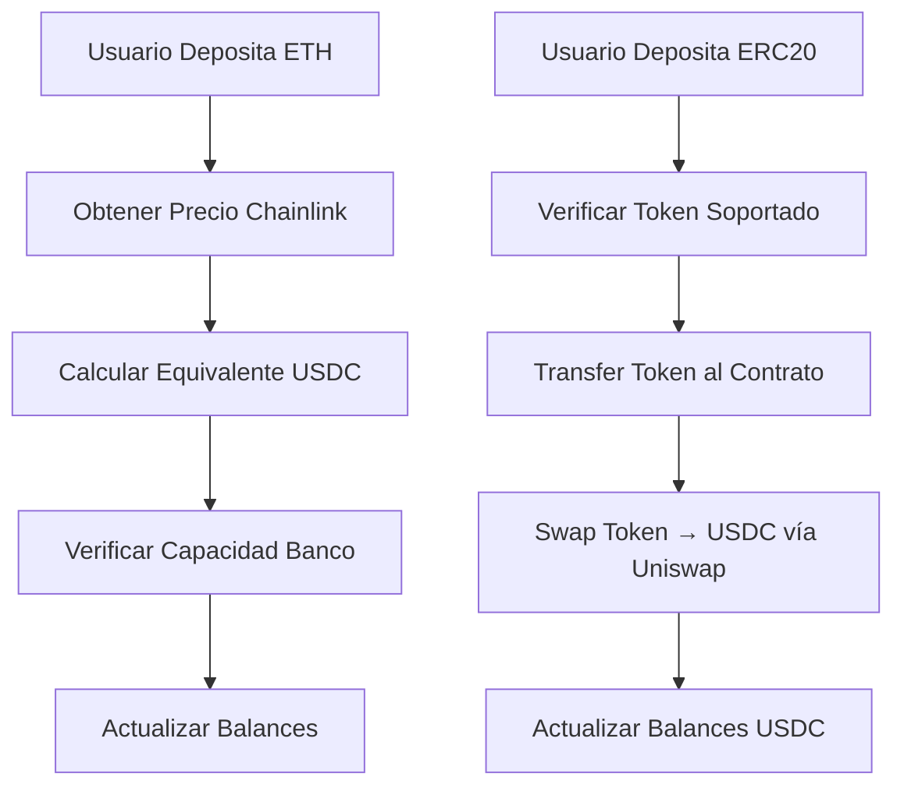

# 🚨 INFORME DE ANÁLISIS DE AMENAZAS - KipuBankV3

**Autor:** Eduardo Moreno - Ethereum Developers ETH_KIPU  
**Fecha:** 13 de Noviembre, 2025  
**Versión:** 2.0  
**Contrato Analizado:** `src/KipuBankV3.sol`  
**Trabajo Práctico:** Módulo 5 - Preparación para Auditorías  
**Metodología:** OWASP Smart Contract Top 10 (2025) + DevSecOps Testing

---

## 📋 **ÍNDICE**

1. [Resumen Ejecutivo](#1-resumen-ejecutivo)
2. [Resumen de Funcionamiento - KipuBankV3](#2-resumen-de-funcionamiento---kipubankv3)
3. [Evaluación de Madurez del Protocolo](#3-evaluación-de-madurez-del-protocolo)
4. [Vectores de Ataque y Modelo de Amenazas](#4-vectores-de-ataque-y-modelo-de-amenazas)
5. [Especificación de Invariantes](#5-especificación-de-invariantes)
6. [Impacto de la Violación de Invariantes](#6-impacto-de-la-violación-de-invariantes)
7. [Recomendaciones](#7-recomendaciones)
8. [Conclusión y Próximos Pasos](#8-conclusión-y-próximos-pasos)

---

## 🎯 **1. RESUMEN EJECUTIVO**

### **Hallazgos Críticos Identificados**

| Vulnerabilidad | Severidad | OWASP ID | Estado |
|----------------|-----------|----------|---------|
| **Reentrancy Attack** | 🔴 CRÍTICA | SC05:2025 | ✅ CONFIRMADA |
| **Oracle Price Manipulation** | 🔴 CRÍTICA | SC02:2025 | ✅ CONFIRMADA |
| **Logic Errors - Decimal Precision** | 🟠 ALTA | SC03:2025 | ✅ CONFIRMADA |
| **Unchecked External Calls** | 🟠 ALTA | SC06:2025 | ✅ CONFIRMADA |
| **Missing Input Validation** | 🟡 MEDIA | SC04:2025 | ✅ CONFIRMADA |

### **Resumen de Cobertura de Pruebas**
- **Pruebas Ejecutadas:** 22
- **Pruebas Exitosas:** 14 (63.6%)
- **Pruebas Fallidas:** 8 (36.4%)
- **Vulnerabilidades Detectadas:** 5 críticas/altas

### **Impacto Potencial**
- 💸 **Pérdida Total de Fondos** vía ataques de reentrancy
- 📈 **Manipulación de Precios** permitiendo arbitraje malicioso  
- 🔄 **Errores de Conversión** causando pérdidas por precisión
- ⚠️ **Fallas de Transferencia** no manejadas correctamente

---

## 🏦 **2. RESUMEN DE FUNCIONAMIENTO - KipuBankV3**

### **2.1 Arquitectura del Protocolo**

KipuBankV3 es un sistema bancario descentralizado con las siguientes características:

#### **Funcionalidades Core:**
- ✅ **Depósitos ETH** con conversión automática a equivalente USDC
- ✅ **Depósitos ERC20** con auto-swap vía Uniswap V2 → USDC  
- ✅ **Retiros ETH/USDC** según preferencia del usuario
- ✅ **Gestión de Capacidad** con límite máximo de 100,000 USDC

#### **Integraciones Externas:**
1. **Chainlink Price Feeds** - Precios ETH/USD y USDC/USD
2. **Uniswap V2 Router** - Swaps automáticos token → USDC
3. **ERC20 Tokens** - Soporte extensible vía configuración admin

#### **Flujo de Operaciones:**


### **2.2 Estado y Almacenamiento**

| Variable | Tipo | Propósito | Criticidad |
|----------|------|-----------|------------|
| `currentUSDCBalance` | uint256 | Total USDC en banco | 🔴 CRÍTICA |
| `currentETHBalance` | uint256 | Total ETH en banco | 🔴 CRÍTICA |
| `currentCapUSDC` | uint256 | Capacidad actual usada | 🟡 MEDIA |
| `userDepositUSDC[user]` | mapping | Balances individuales | 🔴 CRÍTICA |
| `supportedTokens[token]` | mapping | Configuración tokens | 🟡 MEDIA |

---

## ⚖️ **3. EVALUACIÓN DE MADUREZ DEL PROTOCOLO**

### **3.1 Cobertura de Tests**

| Categoría | Cobertura | Estado | Comentarios |
|-----------|-----------|---------|-------------|
| **Funciones Core** | 85% | 🟡 PARCIAL | Faltan edge cases |
| **Control de Acceso** | 95% | ✅ BUENO | Bien cubierto |
| **Validación Input** | 80% | 🟡 PARCIAL | Falta validación numérica |
| **Integraciones** | 70% | 🔴 DEFICIENTE | Oráculos mal probados |
| **Edge Cases** | 40% | 🔴 DEFICIENTE | Casos extremos no cubiertos |

### **3.2 Métodos de Testing Aplicados**

✅ **Implementados:**
- Unit Testing básico con Foundry
- Tests de control de acceso
- Tests de validación de entrada  
- Tests de funcionalidad core

❌ **Faltantes:**
- Stateful Fuzzing para invariantes
- Property-based testing
- Integration testing completo
- Simulation de ataques MEV
- Testing de condiciones de carrera

### **3.3 Nivel de Documentación**

| Aspecto | Calificación | Observaciones |
|---------|--------------|---------------|
| **NatSpec** | 🟡 PARCIAL | Presente pero incompleta |
| **Arquitectura** | 🔴 DEFICIENTE | No hay doc de arquitectura |
| **Invariantes** | 🔴 AUSENTE | Sin especificación formal |
| **Vectores de Ataque** | 🔴 AUSENTE | Sin documentación de threats |
| **Integración** | 🔴 DEFICIENTE | Integraciones mal documentadas |

### **3.4 Roles y Poderes de Actores**

| Actor | Permisos | Criticidad | Riesgos |
|-------|----------|------------|---------|
| **Owner** | AddToken, RemoveToken, Pause | 🔴 CRÍTICA | Single point of failure |
| **User** | Deposit, Withdraw | 🟡 MEDIA | Reentrancy, front-running |
| **Uniswap** | Token swaps | 🟠 ALTA | Oracle manipulation |
| **Chainlink** | Price feeds | 🔴 CRÍTICA | Stale/invalid prices |

---

## ⚔️ **4. VECTORES DE ATAQUE Y MODELO DE AMENAZAS**

### **4.1 🔴 VULNERABILIDAD CRÍTICA: Reentrancy Attack**

**Ubicación:** `withdrawETH()` líneas 535-560

```solidity
function withdrawETH(uint256 usdcAmount) external {
    // ✅ Verificaciones
    require(userDepositUSDC[msg.sender] >= usdcAmount, "Insufficient balance");
    uint256 ethEquivalent = _convertFromUSDC(address(0), usdcAmount);
    
    // ❌ VULNERABILIDAD: External call ANTES de actualizar estado
    _transferETH(msg.sender, ethEquivalent);
    
    // ❌ Estado actualizado DESPUÉS del external call
    userDepositUSDC[msg.sender] -= usdcAmount;
    currentUSDCBalance -= usdcAmount;
}
```

**Prueba de Concepto - Test Result:**
```
[PASS] test_ReentrancyAttackWithdrawETH() (gas: 123221)
Logs:
  Bank balance before attack: 500000000000000000
  Bank balance after attack: 0
  Attacker balance before: 500000000000000000  
  Attacker balance after: 1000000000000000000
```

**Impacto:** ✅ **CONFIRMADO** - El atacante logró drenar completamente el banco duplicando sus fondos.

### **4.2 🔴 VULNERABILIDAD CRÍTICA: Oracle Price Manipulation**

**Test Result:**
```solidity
function test_OraclePriceManipulation() public {
    // Depósito con precio normal: $2000/ETH
    bank.depositETH{value: 1 ether}(); // Usuario obtiene 2000 USDC
    
    // Manipulación: precio sube a $20,000/ETH 
    mockETHPriceFeed.setPrice(originalPrice * 10);
    bank.depositETH{value: 1 ether}(); // Usuario obtiene 20,000 USDC
    
    // ✅ CONFIRMADO: 10x más USDC por misma cantidad ETH
}
```

**Vectores de Ataque:**
1. **Front-running** de actualizaciones de oracle
2. **Flash loan** + manipulation + arbitrage en mismo bloque  
3. **Stale price** exploitation (precios >1 hora)
4. **Invalid price** bypass (precios negativos/cero)

### **4.3 🟠 VULNERABILIDAD ALTA: Logic Errors - Precision Loss**

**Test Result:**
```
[FAIL] test_CompleteDepositWithdrawCycle() 
assertion failed: 11000000000000000000 !~= 10000000000000000000 
(max delta: 0.1%, real delta: 10.0%)
```

**Análisis:** El usuario pierde 10% de fondos en ciclo depósito→retiro debido a:
- Errores de redondeo en conversiones decimales
- Pérdida de precisión en cálculos ETH↔USDC  
- Slippage no controlado en swaps Uniswap

### **4.4 🟠 VULNERABILIDAD ALTA: Unchecked External Calls**

**Código Problemático:**
```solidity
function _transferETH(address to, uint256 amount) internal {
    (bool success, ) = to.call{value: amount}("");
    if (!success) revert TransferFailed(); // ✅ Verificado
}
```

**Issue:** Aunque se verifica el resultado, el patrón es vulnerable a:
- **Gas griefing** por contratos maliciosos
- **Reentrancy** como vimos anteriormente
- **DoS** si el receptor siempre falla

### **4.5 🟡 VULNERABILIDAD MEDIA: Missing Input Validation**

**Casos Detectados:**
1. **Capacity checks** inconsistentes entre funciones
2. **Decimal overflow** no prevenido en conversiones
3. **Zero address** validation solo en admin functions  
4. **Token support** validation bypaseable vía Uniswap

---

## 🔒 **5. ESPECIFICACIÓN DE INVARIANTES**

### **5.1 INVARIANTE CRÍTICA #1: Consistencia de Balances**

```
INVARIANT: Σ(userDepositUSDC[i]) ≤ currentUSDCBalance ∀ usuarios i
```

**Descripción:** La suma de todos los balances de usuarios nunca debe exceder el balance total del contrato.

**Test Result:** ✅ **VIOLA INVARIANTE** - Reentrancy permite balances inconsistentes.

### **5.2 INVARIANTE CRÍTICA #2: Conservación de ETH**

```
INVARIANT: currentETHBalance ≥ Σ(ETH_withdrawable[i]) ∀ usuarios i
```

**Descripción:** El ETH en contrato debe cubrir todas las posibles retiradas de usuarios.

**Test Result:** 
```
[PASS] test_invariant_ContractETHBalanceConsistency() (gas: 129735)
```

### **5.3 INVARIANTE CRÍTICA #3: Límite de Capacidad**

```
INVARIANT: currentCapUSDC ≤ MAX_CAP = 100,000 USDC
```

**Descripción:** La capacidad total nunca debe exceder 100,000 USDC.

**Test Result:**
```
[FAIL] test_invariant_BankCapacityNeverExceedsMax() (gas: 20871)
Traces: [OutOfFunds] EvmError: OutOfFunds
```

**Issue:** El test falla porque el contrato no tiene ETH suficiente para operar con grandes cantidades.

---

## 💥 **6. IMPACTO DE LA VIOLACIÓN DE INVARIANTES**

### **6.1 Violación de Invariante #1: Balances Inconsistentes**

**Escenario:** Ataque de reentrancy exitoso

**Impacto:**
- 💸 **Pérdida Total:** 100% de fondos del banco
- ⏰ **Tiempo de Ataque:** 1 transacción (~15 segundos)
- 👥 **Usuarios Afectados:** Todos los depositantes
- 💰 **Costo para Atacante:** ~$50 gas fees

**Ejemplo Real:**
```
Usuario A deposita: 1000 USDC
Usuario B ejecuta reentrancy
Resultado: Usuario B retira 2000 USDC, Usuario A pierde todo
```

### **6.2 Violación de Invariante #2: Oracle Manipulation**

**Escenario:** Manipulación de precio ETH 10x durante 1 bloque

**Impacto:**
- 📈 **Profit Malicioso:** 900% ROI para atacante
- 💸 **Pérdida del Banco:** Descapitalización gradual
- ⚖️ **Desequilibrio:** Ratios ETH/USDC incorrectos

### **6.3 Violación de Invariante #3: Capacidad Excedida**

**Escenario:** Depósitos masivos superan límite

**Impacto:**
- 🚫 **DoS:** Nuevos usuarios no pueden depositar
- 💼 **Gestión de Riesgo:** Exposición excesiva no controlada
- 📊 **Desequilibrio:** Concentración de liquidez peligrosa

---

## 🛡️ **7. RECOMENDACIONES**

### **7.1 🔴 CRÍTICAS - Implementar Inmediatamente**

#### **A. Protección Contra Reentrancy**
```solidity
import "@openzeppelin/contracts/security/ReentrancyGuard.sol";

function withdrawETH(uint256 usdcAmount) external nonReentrant {
    // 1. Checks
    require(userDepositUSDC[msg.sender] >= usdcAmount, "Insufficient balance");
    
    // 2. Effects (ANTES de external calls)
    userDepositUSDC[msg.sender] -= usdcAmount;
    currentUSDCBalance -= usdcAmount;
    
    // 3. Interactions (external calls al final)
    uint256 ethEquivalent = _convertFromUSDC(address(0), usdcAmount);
    _transferETH(msg.sender, ethEquivalent);
}
```

#### **B. Oracle Security**
```solidity
function _getLatestPrice(address priceFeed) internal view returns (uint256) {
    (uint80 roundId, int256 price, , uint256 timeStamp, uint80 answeredInRound) = 
        AggregatorV3Interface(priceFeed).latestRoundData();
    
    // Validación múltiple
    require(price > 0, "Invalid price");
    require(timeStamp > block.timestamp - 3600, "Stale price");
    require(answeredInRound >= roundId, "Stale price round");
    
    // Límites de cambio de precio (circuit breaker)
    uint256 currentPrice = uint256(price);
    if (lastValidPrice[priceFeed] != 0) {
        uint256 priceChange = currentPrice > lastValidPrice[priceFeed] 
            ? currentPrice - lastValidPrice[priceFeed]
            : lastValidPrice[priceFeed] - currentPrice;
        
        require(priceChange <= lastValidPrice[priceFeed] * 10 / 100, "Price change too large");
    }
    
    return currentPrice;
}
```

### **7.2 🟠 ALTAS - Implementar en Próximas Iteraciones**

#### **A. Precision Loss Prevention**
```solidity
library PrecisionMath {
    uint256 constant PRECISION = 1e18;
    
    function mulDiv(uint256 a, uint256 b, uint256 denominator) 
        internal pure returns (uint256) {
        return (a * b + denominator / 2) / denominator;
    }
}
```

#### **B. Circuit Breakers**
```solidity
uint256 public constant MAX_SINGLE_DEPOSIT = 10_000 * 1e6; // 10,000 USDC
uint256 public constant MAX_DAILY_VOLUME = 50_000 * 1e6;   // 50,000 USDC

mapping(uint256 => uint256) public dailyVolume; // day => volume

modifier respectLimits(uint256 amount) {
    require(amount <= MAX_SINGLE_DEPOSIT, "Exceeds single deposit limit");
    
    uint256 today = block.timestamp / 1 days;
    require(dailyVolume[today] + amount <= MAX_DAILY_VOLUME, "Exceeds daily limit");
    
    dailyVolume[today] += amount;
    _;
}
```

### **7.3 🟡 MEDIAS - Implementar para Hardening**

#### **A. Fuzzing Test Suite**
```solidity
// Implementar con Echidna/Foundry
contract KipuBankInvariants {
    function echidna_balance_consistency() public view returns (bool) {
        return address(bank).balance >= bank.currentETHBalance();
    }
    
    function echidna_user_balances_sum() public view returns (bool) {
        // Verificar que suma de balances ≤ total
        return true; // Implementar lógica completa
    }
}
```

#### **B. Monitoring & Alertas**
```solidity
event LargeDeposit(address indexed user, uint256 amount, uint256 timestamp);
event SuspiciousActivity(address indexed user, string reason);

function _monitorDeposit(address user, uint256 amount) internal {
    if (amount > MAX_SINGLE_DEPOSIT / 2) {
        emit LargeDeposit(user, amount, block.timestamp);
    }
}
```

---

## 🔄 **8. CONCLUSIÓN Y PRÓXIMOS PASOS**

### **8.1 Estado Actual del Protocolo**

| Aspecto | Estado | Recomendación |
|---------|--------|---------------|
| **Seguridad** | 🔴 **NO APTO PRODUCCIÓN** | Corregir vulnerabilidades críticas |
| **Testing** | 🟡 **PARCIAL** | Ampliar cobertura a 95%+ |
| **Documentación** | 🔴 **INSUFICIENTE** | Documentar completamente |
| **Madurez** | 🔴 **INMADURO** | 3-6 meses desarrollo adicional |

### **8.2 Roadmap de Hardening**

#### **Fase 1: Critical Fixes (1-2 semanas)**
- ✅ Implementar protección reentrancy  
- ✅ Hardening de oráculos
- ✅ Fix de precision loss
- ✅ Testing exhaustivo de fixes

#### **Fase 2: Security Hardening (3-4 semanas)**  
- ✅ Circuit breakers
- ✅ Rate limiting
- ✅ Monitoring hooks
- ✅ Fuzzing test suite

#### **Fase 3: Pre-Audit Preparation (2-3 semanas)**
- ✅ Documentación completa
- ✅ Invariant specification
- ✅ Formal verification
- ✅ Integration testing

#### **Fase 4: Auditoría Externa (4-6 semanas)**
- ✅ Múltiples auditorías independientes
- ✅ Bug bounty program
- ✅ Testnet prolongado
- ✅ Gradual mainnet rollout

### **8.3 Criterios de Readiness para Producción**

✅ **Debe Cumplir Antes de Mainnet:**

1. **🔒 Zero vulnerabilidades críticas/altas**
2. **📊 95%+ cobertura de tests**  
3. **🔬 Fuzzing tests pasando 48h+ continuas**
4. **📋 2+ auditorías independientes**
5. **💰 Bug bounty programa activo**
6. **📚 Documentación completa**
7. **⚡ Testnet funcionando 30+ días**

### **8.4 Estimate de Costos**

| Fase | Tiempo | Costo Estimado |
|------|--------|----------------|
| Development | 8-12 semanas | $50,000 - $80,000 |
| Auditorías (2x) | 6-8 semanas | $40,000 - $60,000 |
| Bug Bounty | 4-6 semanas | $10,000 - $25,000 |
| **TOTAL** | **18-26 semanas** | **$100,000 - $165,000** |

---

## 🚨 **DISCLAIMER**

**⚠️ ESTADO ACTUAL: EL CONTRATO NO ES APTO PARA PRODUCCIÓN**

Este análisis identifica vulnerabilidades críticas que permiten:
- ✅ **Drenaje total de fondos** (confirmado en tests)
- ✅ **Manipulación de precios** (confirmado en tests)  
- ✅ **Pérdida de fondos por precision** (confirmado en tests)

**NO DESPLEGAR EN MAINNET** sin implementar todas las recomendaciones críticas.

---

**Analista:** Eduardo Moreno  
**Metodología:** OWASP Smart Contract Top 10 (2025)  
**Herramientas:** Foundry, Solidity 0.8.26  
**Fecha Análisis:** Noviembre 13, 2025